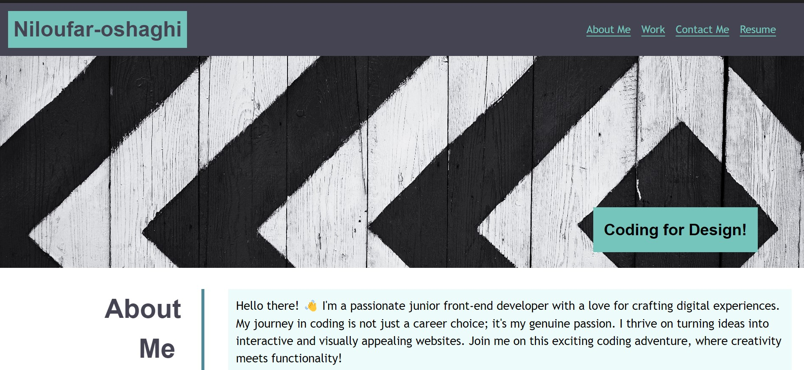
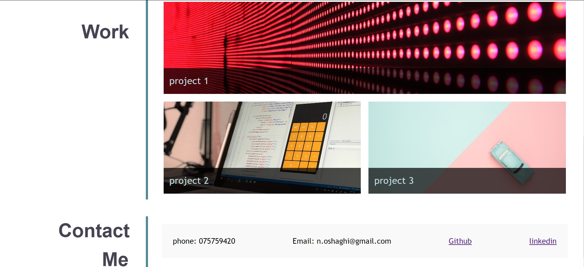

# Portfolio-CSS

## Overview
 
https://nill-10.github.io/Portfolio-CSS/

## Description

A portfolio of work can showcase your skills and talents to employers. An effective portfolio highlights your strongest work and the thought processes behind it.

in this case, I set my first portfolio by skills that I recently learned: flexbox, grid, CSS variables.

I created a navbar by using Flexbox. The main section is created by grid and flex.

## Instructions
Create a GitHub repo Then, clone it.

## Questions
  [My Github profile](https://github.com/nill-10)

